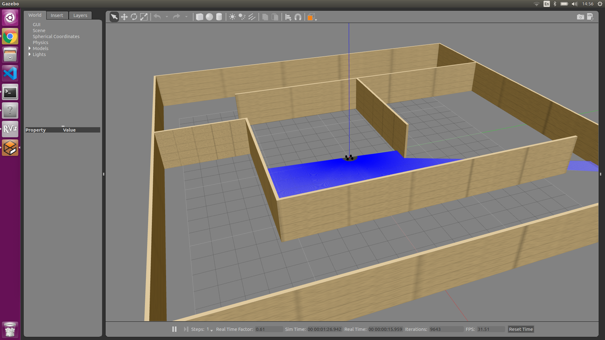

# ackermann_steering
- Image of world model Ackermann Steering.

* USAGES *

- roscore
- roslaunch my_robot gazebo_launch.launch 				(Turn on gazebo simulation)
- roslaunch my_robot controller.launch	 				(Turn on controller for simulation)
- roslaunch obstacle_detector my_launch.launch 				(Turn on obstacle detector, then move robot to a position that can detector object)
- rosrun my_robot move_base.py						(Move to started point of tracjectory.)
- rosrun my_robot move_slalom.py					(Move slalom trajectory.)
